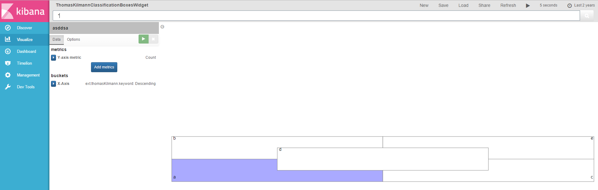

# Thomas Kilmann Classification Visualizations Plugin for Kibana 5




### About
This is a plugin for Kibana5+. Has been developed and tested on Kibana 5.0.0.

### Usage
Installation steps:
```
$ cd KIBANA_HOME/plugins
$ git clone https://github.com/e-ucm/tk-kibana-vis.git tk-kibana-vis
$ cd tk-kibana-vis
$ npm install
```
> **Note:** If you can not see the plugin in the plugin list, or get kibana warning like "**Plugin "tk-widget" was disabled because it expected Kibana version "5.1.0", and found "5.0.0" please modify package.json file and put your kibana version.

Unistall:
```
$ bin/kibana plugin  --remove tk-kibana-vis
```

### Contributions (Work in progress)
Anyone is welcome to contribute to my project. There are various ways you can contribute:

1. Raise an [Issue](https://github.com/e-ucm/tk-kibana-vis/issues) on GitHub
2. Send a Pull Request with your bug fixes and/or new features
